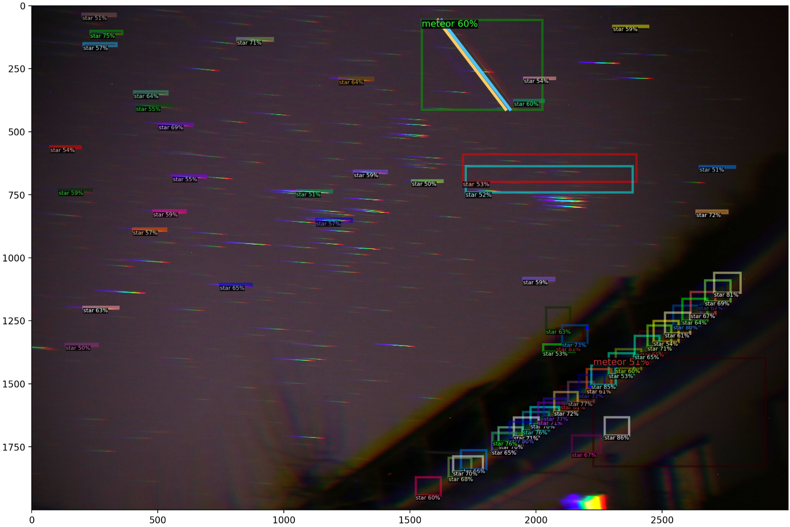

# Metspec

This code performs the detection and photometry of slitless meteor spectra captured by DSLR. The goal is to recognize the track of bright stars and Na and Mg spectra and perform photometry on it. Below is a preliminary result at `51ad2d3`. Up to now, it can roughly recognize the position of meteors, and more adjustments are needed. 

## Docs

* `generate_dataset.ipynb`: generates the fake meteor dataset to train the network
* `training.ipynb`: trains the network
* `photometry.ipynb`: performs photometry based on the result of network
* `utils.py`: pre-defined utility functions to prettify the code

